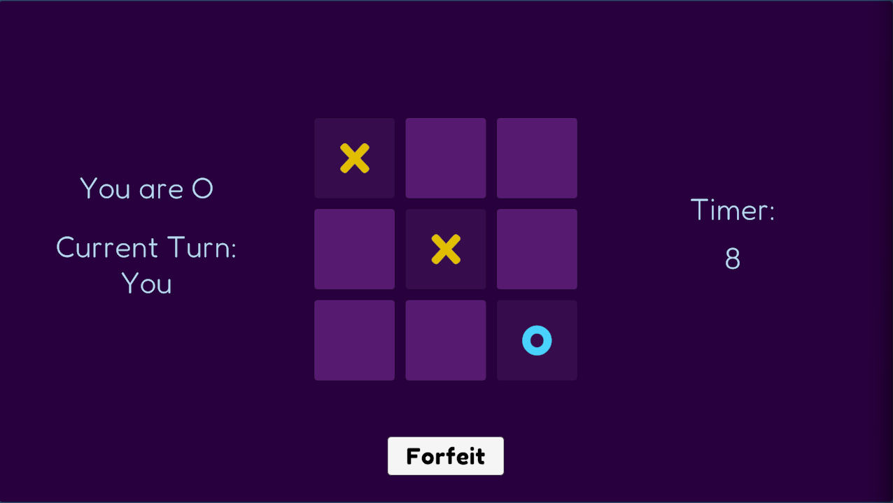
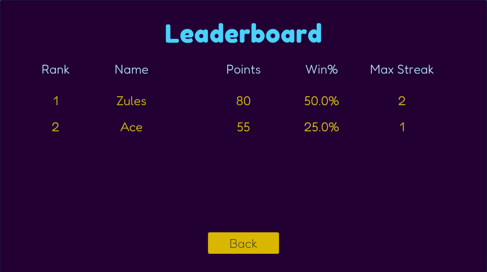

# Nakama Backend

This repository contains the authoritative server-side logic for the Unity Tic-Tac-Toe multiplayer game. Built using **Nakama**, it ensures all game state, matchmaking, and player progress are managed securely and efficiently.

## 🚀 Key Responsibilities

- **Authoritative Match Loop:** Prevents client-side manipulation by validating moves on the server.
- **Matchmaking:** Handles player pairing based on selected modes (Classic vs. Timed).
- **Persistent Storage:** Manages player stats, match history, and streaks.
- **Leaderboards:** Automatically updates global rankings after every match.

## 🛠️ Tech Stack

- **Server:** [Nakama Server](https://heroiclabs.com/) (Heroic Labs)
- **Language:** TypeScript
- **Infrastructure:** Docker & Docker Compose
- **Deployment:** AWS EC2 (Ubuntu) with Nginx reverse proxy.
- **Bundling:** Rollup & Babel for generating Nakama-compatible JavaScript modules.

## ⚙️ Architecture & Logic

1. **Server Authoritative Logic:** The board state is maintained entirely on the server. Clients send "move" requests (OpCode 2), and the server broadcasts "update" (OpCode 3) or "done" (OpCode 4) messages after validation.
2. **Opcodes:**
   - `1`: START_GAME
   - `2`: MOVE
   - `3`: UPDATE
   - `4`: DONE
3. **Tick Rate:** Optimized at 10 ticks per second for responsive real-time interaction.
4. **Timed Mode:** Implements a server-side timer that automatically awards wins if a player fails to move within the deadline.

## 📸 System Overview

| Gameplay Interaction | Leaderboard & Stats |
| :---: | :---: |
|  |  |

## 🚀 Setup & Deployment

### Local Development

1. **Clone the repo:**

   ```bash
   git clone https://github.com/SiddharthBITS/unityBackend.git
   ```

2. **Build the modules:**

   ```bash
   npm install
   npm run build
   ```

3. **Run with Docker:**

   ```bash
   docker-compose up -d
   ```

4. **Access Console:** The Nakama Console will be available at [http://localhost:7351](http://localhost:7351) (User: `admin`, Pass: `password`).

### Cloud Deployment (AWS EC2)

- Ensure ports `7349` (gRPC), `7350` (API), and `7351` (Console) are open in Security Groups.
- Nginx is used as a reverse proxy to handle SSL and CORS for WebGL clients.

## 🤝 Connect

- **LinkedIn:** [Siddharth Sengar](https://www.linkedin.com/in/sengarsiddharth/)
- **GitHub:** [@SiddharthBITS](https://github.com/SiddharthBITS)
